```{r setup, echo=FALSE}
options(htmltools.dir.version = FALSE)
knitr::opts_chunk$set(warning = FALSE, message = FALSE) 
library(xaringanExtra)
library(xaringanthemer)
library(xaringanBuilder)

xaringanExtra::use_tachyons()
xaringanExtra::use_fit_screen()
xaringanExtra::use_scribble()
xaringanExtra::use_panelset()
```

class: center, middle, split-three
<style>
p.caption {
  font-size:0.6em;
}
</style>

.row[
.split-three[
.column[
.content[
<br>
```{r, echo=FALSE, fig.align="left", out.width="50%"}
knitr::include_graphics("https://www.uerj.br/wp-content/uploads/2018/02/logomarca-uerj.png")
```
]
]
.column[
.content[
<br>
<br>
```{r echo=FALSE, fig.align="center"}
knitr::include_graphics("http://www.pgbv.uerj.br/wp-content/uploads/2020/08/cropped-header_pgbv_2020.png")
```
]
]
.column[
.content[
<br>
```{r, echo=FALSE, fig.align="right", out.width="50%"}

```
]
]
]
]
.row[
.content.vmiddle[
## .center[The role of functional similarity for community assembly at multiple spatial scales]
]
]
.row[
.content[
#### Caio Graco Rodrigues Leandro Roza
##### Advisor: Marcelo Manzi Marinho
##### Co-Advisor: Janne Soininen
###### 12/05/2021 
]
]

???
Boa tarde, como alguns de vocês já sabem meu nome é Caio Graco e eu vou apresentar hoje os resultados da minha tese, onde nós estudamos o papel da similaridade funcional no processo de montagem de comunidades em diferentes escalas espaciais. 

Essa tese foi orientada pelo professor marcelo manzi marinho na UERJ a co-orientada pelo professor janne soininen da universidade de helsinque.

---
layout:true
class: left, top, split-two with-border


.column[.split-four[
.row.bg-main1[.content.vmiddle.center[
# What's with the scale?
]
]
.row.bg-main2[.content[
Studying communities require the definition of <b>spatial and temporal scales</b>.
]]
.row.bg-main3[.content[
What are the mechanisms underlying patterns?
]]
.row.bg-main4[.content[
Patterns result from mechanisms operating at different spatial and temporal scales than the those on which the patterns are observed .tiny[(LEVIN, 1992)].

]]
]]

.column[
.content.vmiddle.center[
```{r, echo=FALSE, fig.cap="Source: LEVIN 1992", fig.align="right", out.width="100%"}
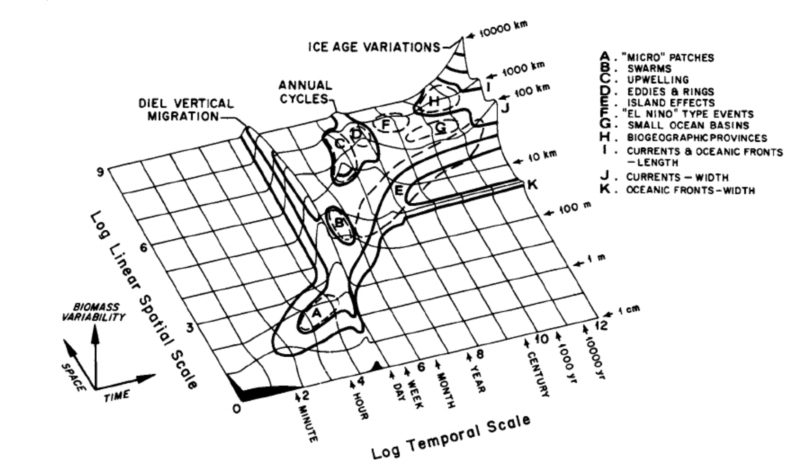
```
]
]

---
class: gray-row2-col1 fade-row2-col1 gray-row3-col1 fade-row3-col1 gray-row4-col1 fade-row4-col1 fade-col2
count:true

???

Para estudar ecologia de comunidades é necessário a determinação de escalas


---
class: gray-row3-col1 fade-row3-col1 gray-row4-col1 fade-row4-col1 fade-col2
count:false

???

e requer que sejam estabelecidas escals espaciais e temporais como uma maneira de facilitar a construção de hipóteses e delineamento amostral.

.
---
class: gray-row2-col1 fade-row2-col1 gray-row4-col1 fade-row4-col1 fade-col2
count:false

???

Ainda assim, é dificil de explicar quais os mecanismos estão por trás do padrões observados

---
class: gray-row2-col1 fade-row2-col1 gray-row3-col1 fade-row3-col1 
count:false 

???

Uma vez que esses padrões resultam de mecanismos que ocorrem em diferentes escalas daquelas que amostramos.

Zooplankton, migração vertical na coluna d'agua, ciclos anuais, correntes oceânicas.
---

layout:true
class: middle, split-three with-border
.column[
.split-two[
.row.bg-main1[
.content[
### What about the functional similarity?
 <i>"We must consider the distinctive characters and the general nature of plants from the point of view of their morphology, their behaviour under external conditions, their mode of generation, and the whole course of their life"</i>
.right[.tiny[
Theophrastus, 300 B.C]
]
]
]
.row.bg-light-white70[ 
.content.nopadding[
```{r, echo=FALSE, out.width="70%", fig.cap="Source: By Sylvia Freeman", fig.align='center'}
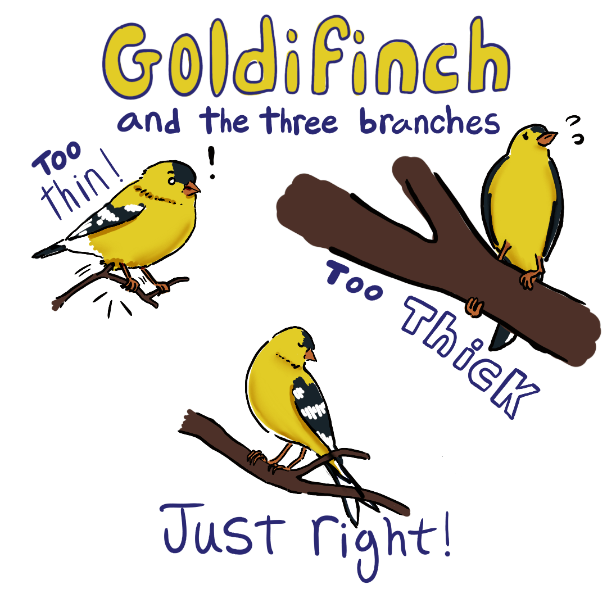
```
]]
]
]
.column[
.split-two.border-white[
.row[
.content.nopadding[
### .tiny[.center[Difference allows coexistence.]]  
<br>
```{r, echo=FALSE, fig.align="left", fig.width=5, fig.height=3}
require(tidyverse)
set.seed(1234)
sp1<- data.frame(id = "spp1", niche = rnorm(1000,mean=1,sd=3))
sp2<- data.frame(id = "spp2", niche = rnorm(1000,mean=10,sd=3))  
df<- rbind(sp1,sp2)
plot1 <- df %>% ggplot(aes(x=niche+10, fill=id)) + geom_density(alpha=.5, show.legend = FALSE) +labs(y="Abundance", x="Environmental gradient") + theme_xaringan() + scale_xaringan_fill_discrete() 
plot1

```
]
]

.row[
.content.nopadding[

### .tiny[.center[What if species are similar?]]
<br>
```{r, echo=FALSE, out.width="90%", fig.cap = "Source: VANDERMEER 2006", fig.align="center" }
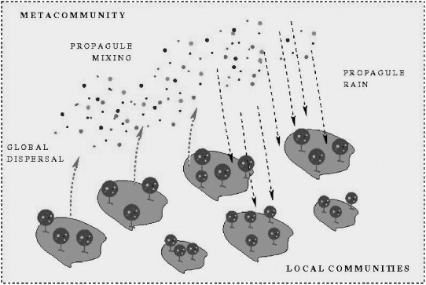
```
]
]
]
]

.column[.content.nopadding[
<br>
One can group species in **functional groups**...
<br>
```{r, echo=FALSE, out.width="90%", fig.cap = "Source: KRUK et al. 2010", fig.align="center" }
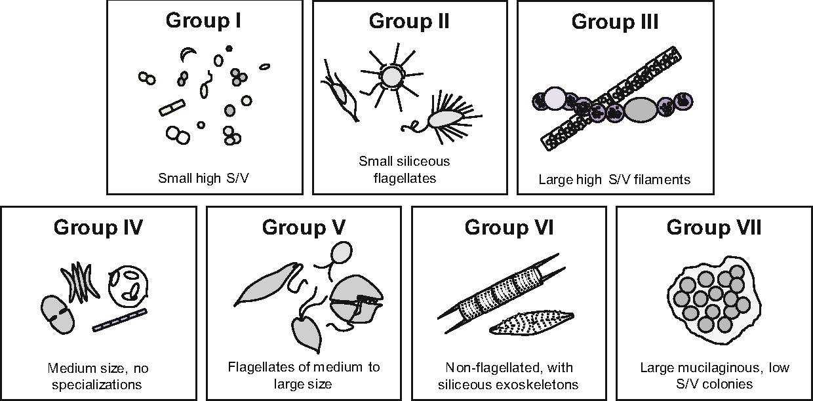
```
<br>
.right[...or measure **individual traits** and match them with environmental template]
```{r, echo=FALSE, fig.cap="Source: BLONDER et al. 2014", out.width='80%',fig.align='center'}
knitr::include_graphics("multi_niche.gif")
```
]]
---
class: fade-row2-col1 fade-row1-col2 fade-row2-col2 hide-col3
count:true

???
Além disso, para compereender esses padrões, também é preciso estudar as características de cada espécies, como por exemplo, a morfologia, fisiologia e fenologia, comumente chamos de atributos funcionais.
---
class: fade-row1-col2 fade-row2-col2 hide-col3
count:false
???
isso porquê essas características vão determinar a maneira com a qual as espécies interagem com o ambiente e entre si. Por exemplo, o tamanho da pata e o peso de um pássaro, vão determinar o tipo de árvore que esses indivíduos podem pousar, dentre outras coisas.

---
class: fade-row2-col1 fade-row2-col2 hide-col3
count:false

???
Utilizando essas características é possível estimar o nível de sobreposição de nicho em uma comunidade e compreender, em escala local,  a coexistencia de espécies.
---
class: fade-row2-col1 fade-row1-col2 hide-col3
count:false

???
Em escala regional,as metacomunidades, ou seja, comunidades conectadas por dispersão de organismos, vão apresentar fluxo contante de indivíduos, e nesse caso a substituição de uma espécie por um par funcionalmente equivalente, se dá por processos estocasticos, como imigração, extinção local, especiação, etc.

---
class: fade-row2-col1 fade-row1-col2 fade-row2-col2
count:false

???
Existem pelo menos duas linhas de estudo que trabalham esses conceitos do ponto de vista das características das espécies. Uma delas consiste na utilização de grupos funcionais préviamente estabelecidos baseados a partir de observações da maneira com a qual as espécies respondem às variações ambientais.

Por outro lado, pode-se medir os atributos funcionais de cada espécie diretamente,e relacionar isso com as variáveis abióticas ou tipos de habitat estudados.
---
layout:true
class:split-three with-border border-black

.column[.split-two[
.row.bg-main1[.content.nopadding[
### Emergent neutrality
<br>
<br>
"Species must evolve to become *sufficiently similar* or *sufficietly different* to coexist."
.tiny[.right[SCHEFFER; VAN NES; VERGNON, 2018]]
]]
.row.bg-light-gray[.content.nopadding[
<br>
```{r, echo=FALSE, fig.cap="", out.width='70%', fig.align='left', fig.cap="Source: SCHEFFER; VAN NES; VERGNON, 2018"}
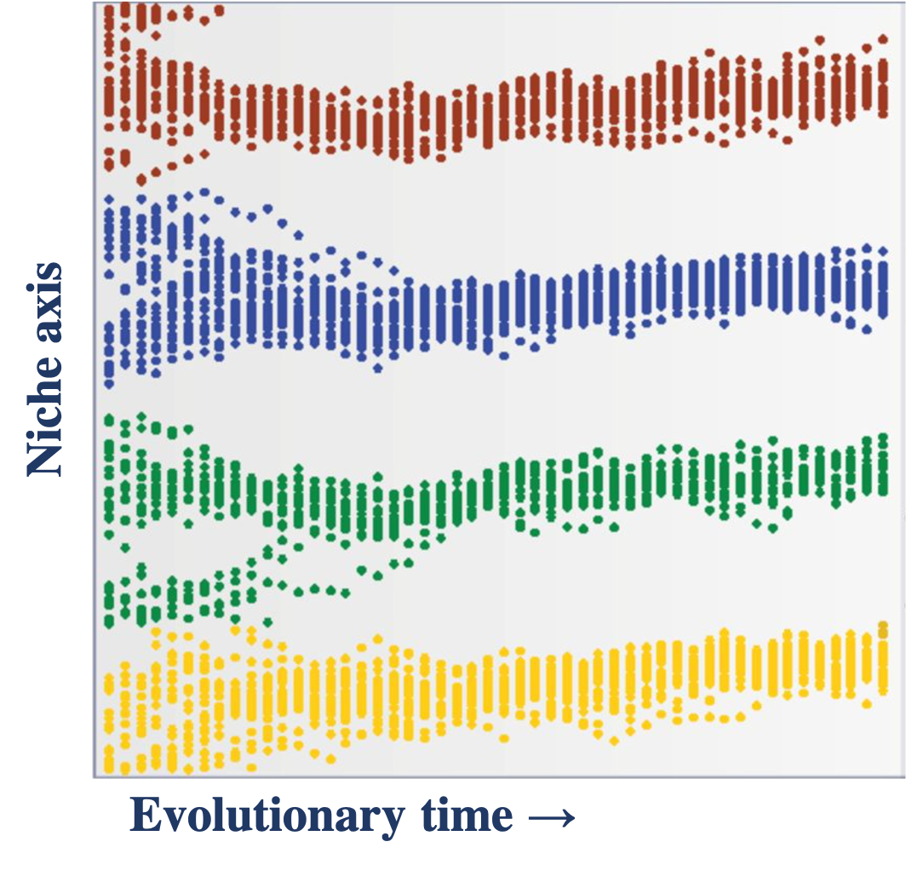
```
]]
]]

.column[.split-two[.row[.content.nopadding[
### .tiny[.center[Modelling evidence]]
<br>
```{r, echo=FALSE, fig.cap="", out.width='70%', fig.align='center', fig.cap="Source: MATTHEWS & WHITTAKER, 2014"}
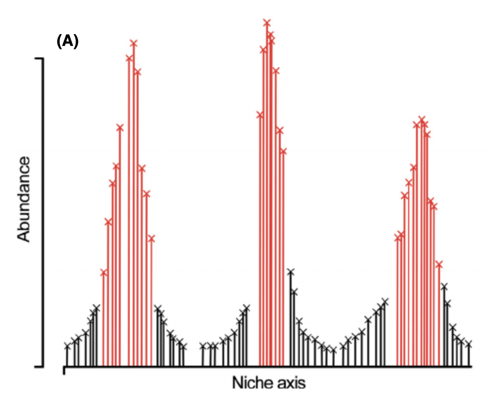
```

]
]

.row.bg-main4[
.content.nopadding[
### .tiny[.center[.white[Empirical evidence]]]
<br>
```{r, echo=FALSE, fig.cap="", out.width='70%', fig.align='center', fig.cap="Source: SEGURA et al., 2010"}
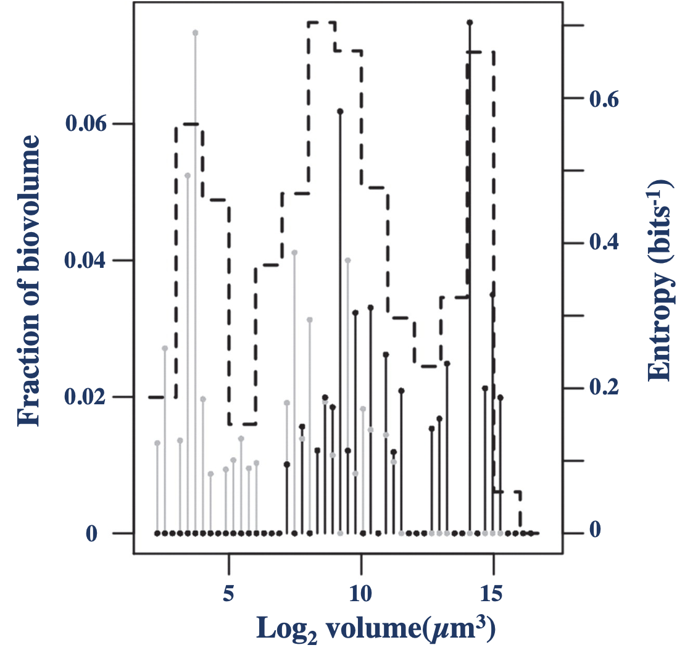
```
]
]
]
]

.column.bg-main5[

.content.nopadding[
###.black[Body size as niche axis...]
<br>
<br>
```{r, echo=FALSE, fig.cap="", out.width='90%', fig.align='center', fig.cap="Source: SEGURA et al., 2010"}
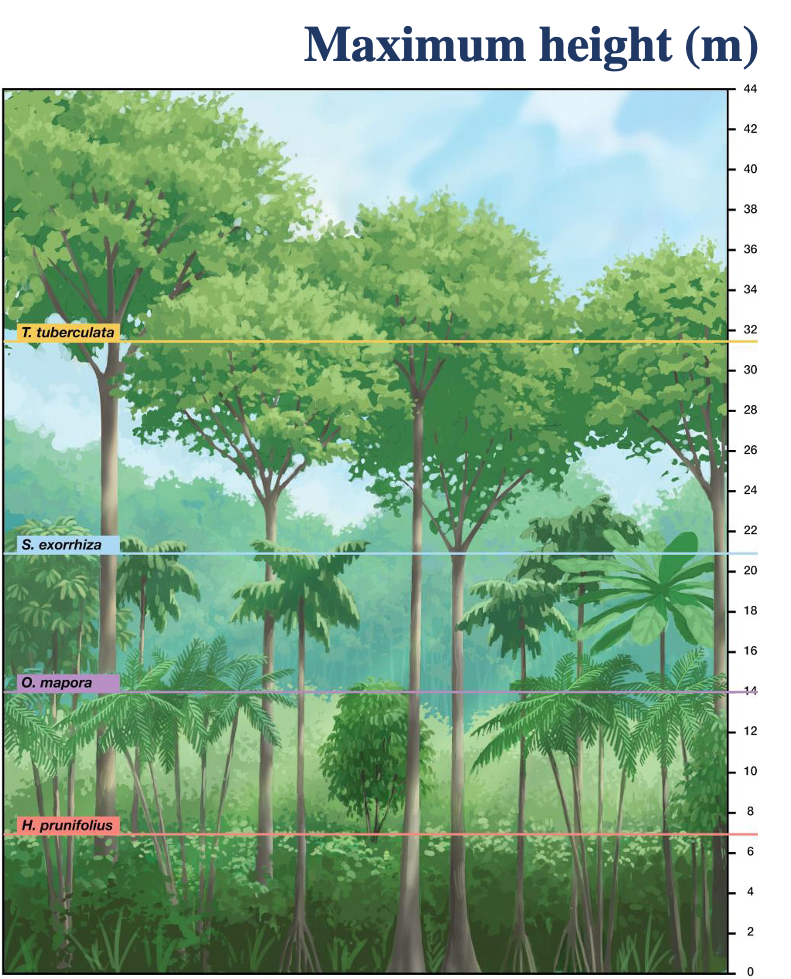
```
]
]


---
class:  fade-row2-col1 fade-row1-col2 fade-row2-col2 gray-row2-col2 hide-col3
count:true

???
Mais recentement, foi proposto que as espécies evoluem em direção a um número limitado de grupos funcionais, e essa evolução converge para que as espécies evitem a competição.
---
class:   fade-row1-col2 fade-row2-col2 gray-row2-col2 hide-col3
count:false

???
Ou as espécies se tornam diferentes o suficientes para ocupar diferentes espaços de nicho, ou elas se tornam parecidas de maneira que a competição entre espécies se assemelhe a competição intraespecifica
---
class:  fade-row2-col1  fade-row2-col2 gray-row2-col2 hide-col3
count:false

???
Nesse sentido, foi proposto que ao ordenar as espécies ao longo de um eixo de nicho, as espécies apresentariam agrupamentos com picos de abundancia, nos quais as espécies presentes estão adaptadas às condições de nicho, e vales de espécies com baixa abundancia que são espécies que não são favorecidas pelas condições abióticas, mas são inseridas e mantidas na comunidade por dispersão.

---
class:  fade-row2-col1 fade-row1-col2 fade-row1-col3 hide-col3
count:false
---
class:  fade-row2-col1 fade-row1-col2 fade-row2-col2 gray-row2-col2 
count:false

???

Porém, os estudos que corroboram a neutralidade emergente, utilizam apenas o tamanho do organismo para contrutir o eixo de nicho, e não há estudos que explorem os agrupamentos utilizando multiplas dimensões do espaço funcional.

Além disso, também seria importante de compreender em quais escalas espaciais a inserção de espécies por dispersão ocorre, a pra isso é preciso compreender um dos padrões mais observados da biogeografia, que é ...

---
layout:true
class: left, top, split-three with-border 

.column[.split-two[
.row.bg-main1[
.content.nopadding[
### Distance decay of similarity
<br>

.small["The similarity between two observations often decreases or decays as the distance between them increases, a pattern long recognized in the geographical literature and once called ‘the first law of geography’."]
.right[.tiny[NEKOLA & WHITE, 1999]]
]
]
.row[
.content.nopadding[
```{r, echo=FALSE, fig.cap="Source: NEKOLA & MCGILL, 2014", out.width="55%", fig.align='center'}
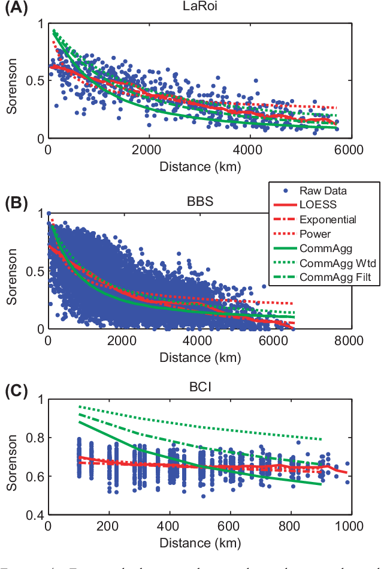
```
]]

]]

.column[
.split-two.border-white[
.row[ 
.content.vmiddle.center[
##.black[Environment <br> vs.<br> dispersal]
]
]
.row.bg-main1[
.content.vmiddle.center[
#.small[Functional traits<br>vs.<br>Taxonomic identity]
]
]
]]

.column[
.split-four[
.row.bg-main1[
.content[Spatial scale<br>.tiny[(NEKOLA; WHITE, 1999; NEKOLA; MCGILL, 2014)].]
]
.row.bg-main2[
.content[Latitude<br>.tiny[(QIAN, 2009; QIAN; BADGLEY; FOX, 2009)].]
]
.row.bg-main3[
.content[Local and/or regional diversity<br>.tiny[(HILLEBRAND, 2004; SOININEN, 2010)].]
]
.row.bg-main4[
.content[Ecosystem type<br>.tiny[(CORNELL; HARRISON, 2013)].]
]
]
]
---
class: fade-row2-col1 hide-row1-col2 hide-row2-col2 gray-row1-col3 gray-row2-col3 gray-row3-col3 gray-row4-col3
count:true

???
O decaimento da similaridade com a distância, ou seja, comunidades apresentam diferentes compositições na medida que a distancia  geografica entre elas aumenta

---
class: hide-row1-col2 hide-row2-col2 gray-row1-col3 gray-row2-col3 gray-row3-col3 gray-row4-col3
count:false
???

Existem diferentes tipos de decaímento, mas o mais comum deles é o decaímento exponencial, que ocorre quando a área de estudo cobre mais do que uma metacomunidade.
---
class: hide-row2-col2 gray-row1-col3 gray-row2-col3 gray-row3-col3 gray-row4-col3
count:false
???

Isso pode ser explicado tanto pelo fato de que o aumento da distância implica na modificação das condições de nicho, ou pelo simples fato de as espécies serem limitadas em sua dispersão.

Alguns fatores geográficos também vão afetar esse padrão, por exemplo:
---
class: hide-row2-col2 gray-row2-col3 gray-row3-col3 gray-row4-col3
count:false

---
class: hide-row2-col2 gray-row1-col3 gray-row3-col3 gray-row4-col3
count:false

---
class: hide-row2-col2 gray-row1-col3 gray-row2-col3  gray-row4-col3
count:false
---
class: hide-row2-col2 gray-row1-col3 gray-row2-col3 gray-row3-col3
count:false
---
class: gray-row1-col3 gray-row2-col3 gray-row3-col3 gray-row4-col3
count:false

???

Uma forma de entender esse balanço entre dispersão e nicho é comparando o decaimento da similaridade taxonomica e funcional.Baseando-se na ideia de que comunidades limitadas por dispersão em um ambiente relativamente homogeneo apresentariam um decaímento taxonomico mais expressivo do que um decaimento da similaridade funcional.
---

layout:true
class: left, middle, split-four  with-border

.row.bg-main1[.content.vmiddle[
# Objective

The overarching aim of this thesis is to explore the role of functional similarity in the community assembly processes at local, regional, and global scale.
]]
.row.bg-main2[.content[
.left-column[ 
### .small[.lightest-blue[Local scale <br> .tiny[(Chapter I)]]]
]
.right-column[
Whether species with similar functional traits respond similarly to environment, and whether their abundance varies stochastically.
]
]]

.row.bg-main3[.content[
.left-column[
### .small[.light-blue[Regional scale <br> .tiny[(Chapter II)]]]
]
.right-column[

whether functional composition relates stronger to environmental constraints than taxonomic composition, and whether functional traits respond to the dispersal dynamics of the ecosystem.

]
]]

.row.bg-main4[.content[
.left-column[ 
### .small[.navy[Global scale <br> .tiny[(Chapter III)]]]
]
.right-column[
Whether the balance between taxonomic and functional response to environment is consistent across multiple organisms, whether the geographic factors e.g., latitude, realm, and spatial extent affects the community response to environmental and spatial gradients
]
]]

---
class: fade-row2 gray-row2 fade-row3 gray-row3 fade-row4 gray-row4
count:true
---
class:  fade-row1 fade-row3 gray-row3 fade-row4 gray-row4
count:false
---
class: fade-row1 fade-row2 gray-row2  fade-row4 gray-row4
count:false
---
class: fade-row1 fade-row2 gray-row2 fade-row3 gray-row3 
count:false
---
layout:false
class: center, middle, inverse

# .white[Functional similarity at the local scale]

###.white[Clumpy coexistence – the role of functional similarity to community assembly.]

####.white[Accepted in].bold[PCI Ecology]

---
class:inverse
### Overview


- Eco-evolutionary dynamics .tiny[(GRAVEL et al., 2006; HUBBELL, 2006; SCHEFFER; VAN NES, 2006)].

- Empirical evidence is still scarce .tiny[(SCHEFFER et al. 2018)].
 
- Body size vs multidimensional traits.

- Phytoplankton as a model organism.

- Functional groups as a way to test neutrality

- Functional traits as a way to test neutrality

- Rivers as heterogeneous systems.

???
Bom, no capítulo 1 nós discutimos sobre a similaridade funcional do posto de vista da neutralidade emergente. Como dito anteriormente, a neutralidade emergente é um resultados de dinâmicas eco-evolutivas, our seja, as espécies evoluem de maneira a se agrupar em diferentes grupos funcionais e dentro desses grupos, as interações competitivas são quase neutras. 

As evidências pra esse modelo, ainda que existam são incipientes. Além disso, os estudos utlizam o tamanho do corpo como traço, mas da mesma forma que o nicho é multidimensional, os arranjos funcionais das comunidades também o são.

Nesse sentido, o fitoplâncton é um ótimo organismos teste tanto porque tem um curto tempo de geração, quanto porque as relações entre traços funcionais e condições ambientais são bastante conhecidas.

Já existem evidências empiricas para o fitoplâncton de lago e marinho, mas não há nenhum estudo para o fitoplâncton de rios, ainda que rios sejam sistemas bastante heterogeneos e que podem contribuir empiricamente para a validade da teoria em sistemas não estáveis.

---
layout:true
class:split-five with-border
.row.bg-main1[.content.vmiddle[
# Hypotheses]]
.row.bg-main2[
.content.vmiddle.center[
 .bold[H1] – There are peak aggregations of species abundance (i.e., clumps) along the body size axis of phytoplankton in the river that remain constant across space and time as a result of eco-evolutionary processes.
]]
.row.bg-main3[
.content.vmiddle.center[
.bold[H2] – Pairwise-differences in species abundances increase with functional dissimilarity at the community-level but not at the clump level because species within the same clump behave in a quasi-neutral state.
]]
.row.bg-main4[
.content.vmiddle.center[
.bold[H3] – Species abundance increases with functional distinctiveness of the species with respect to other species within the clumps.
]]
.row.bg-main1[.content[

]]
---
class: fade-row3 gray-row3 fade-row4 gray-row4
---
class: fade-row2 gray-row2 fade-row4 gray-row4
count:false
---
class: fade-row3 gray-row3 fade-row2 gray-row2
count:false
---

layout:false
class:left, top
.left-column[
### Methods
Nine sampling sites along the river channel

Monthly samples between May 2012 - Apr 2013

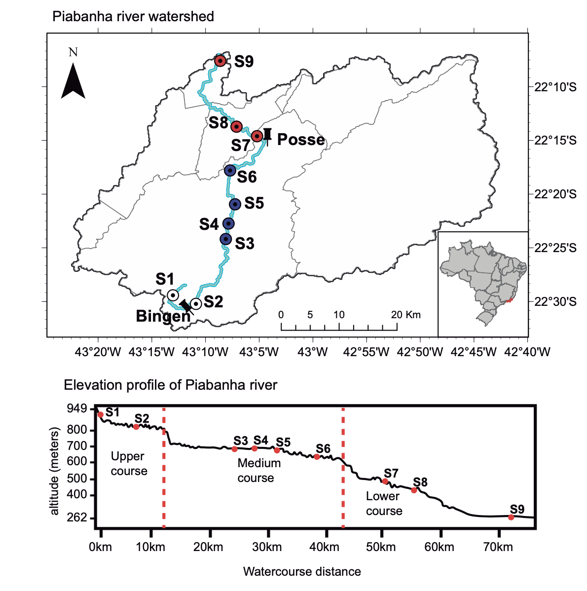

]
.right-column[
```{r, echo=FALSE, out.width="95%", fig.align="right"}
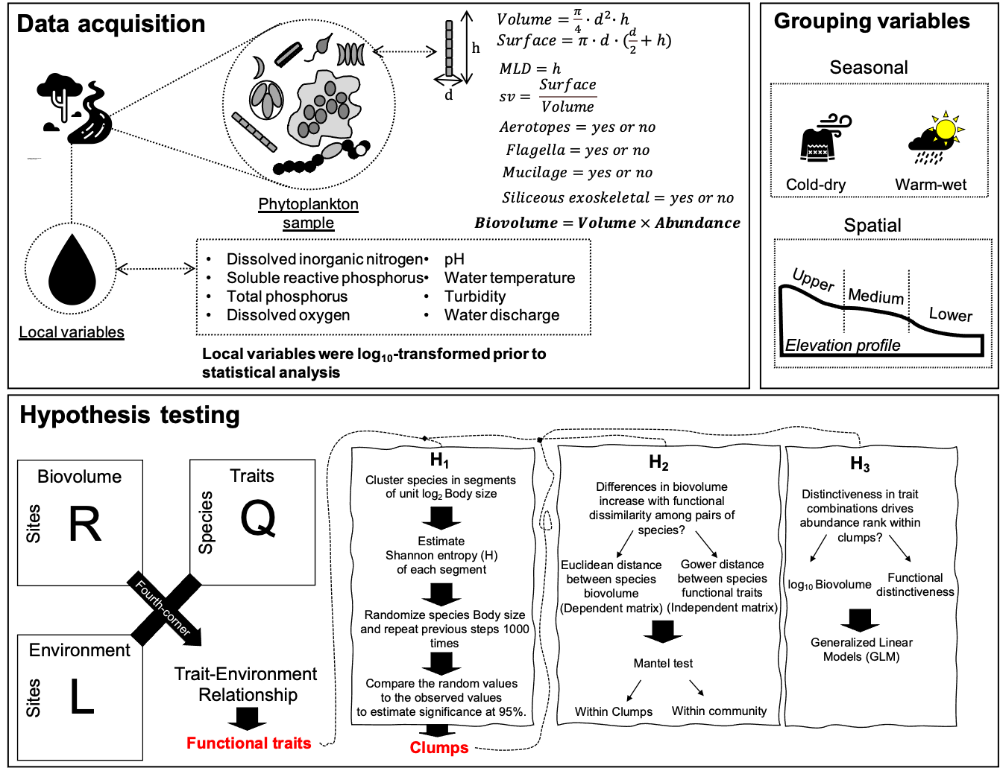
```
]
---
class:top
# Results
<br>
<br>

A total of **150 species** were observed distributed in six functional groups 

```{r, echo=FALSE}
require(tidyverse)
require(kableExtra)
knitr::kable(data.frame("MBFG" = c("I","III","IV","V","VI","VII"),
           "Number of species" = c("9","3","60","13","57","8"), 
           "Representative taxa" = c( 
            "*Chroococcales* sp., *Chroococcus* sp.",
"*Limnothrix* sp.",
"*Pseudanabaena limnetica*, *seudanabaena catenata*", "*Euglena* sp., *Cryptomonas* sp.",
"*Cymbella* sp., *Synedra* sp.", "*Dictyosphaerium* sp."
             )),format="markdown", col.names = c("MBFG","Number of species","Representative taxa")) 


```

---
class:split-two

.column[.content[
#Results

- Axes summarised spatial and seasonal patterns;

- Functional groups did not overlap;

- Silica, flagella and size-related traits were the most important.

- MBFG VI = Silica; MBFG V = Flagella, MBFG IV = size-traits;

]]
.column[.content.vmiddle.center[
```{r, echo=FALSE, out.width="100%"}
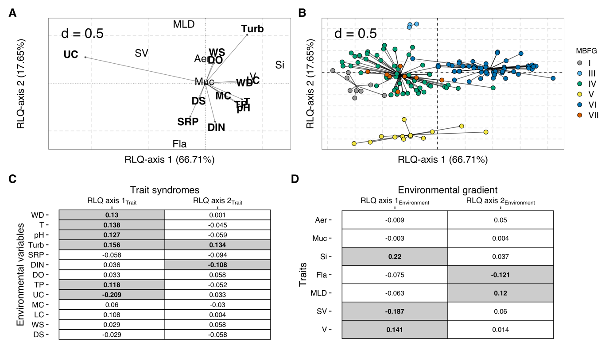
```
]]

---
class:split-two
layout:true

.column[.split-five[
.row.bg-main1[.content[
### Results
- Significant clumps in the same range as other studies .tiny[(SEGURA et al., 2011; 2012)].
]]
.row.bg-main2[.content[
- More than one functional group per clump .tiny[(BARABÁS et al. 2013)]. 
- MBFG IV, V and VI in different clumps.
]]
.row.bg-main3[.content[
- Niche partitioning for overall community, and for Clump I at the .bold[upper course].
]]
.row.bg-main4[.content[
- Different size class during wet season (Ecological compartments).
]]
.row.bg-main5[.content[
- Significant increase in abundance given functional distinctiveness .bold[(not for clump II)].
]]
]]

.column[
.content[
.panelset[
  .panel[.panel-name[Seasonal]
```{r, echo=FALSE}
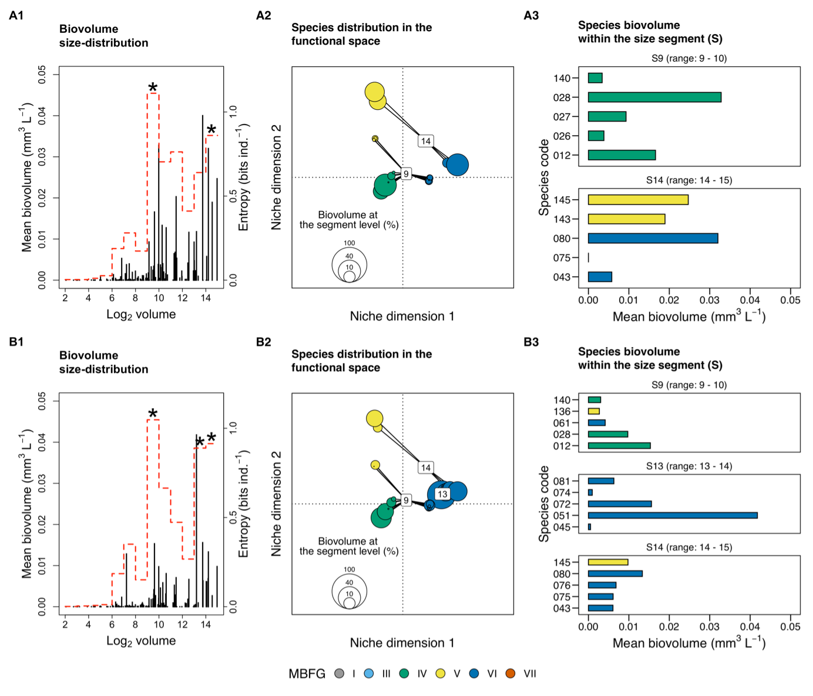
```
]
  .panel[.panel-name[Spatial]
```{r, echo=FALSE}
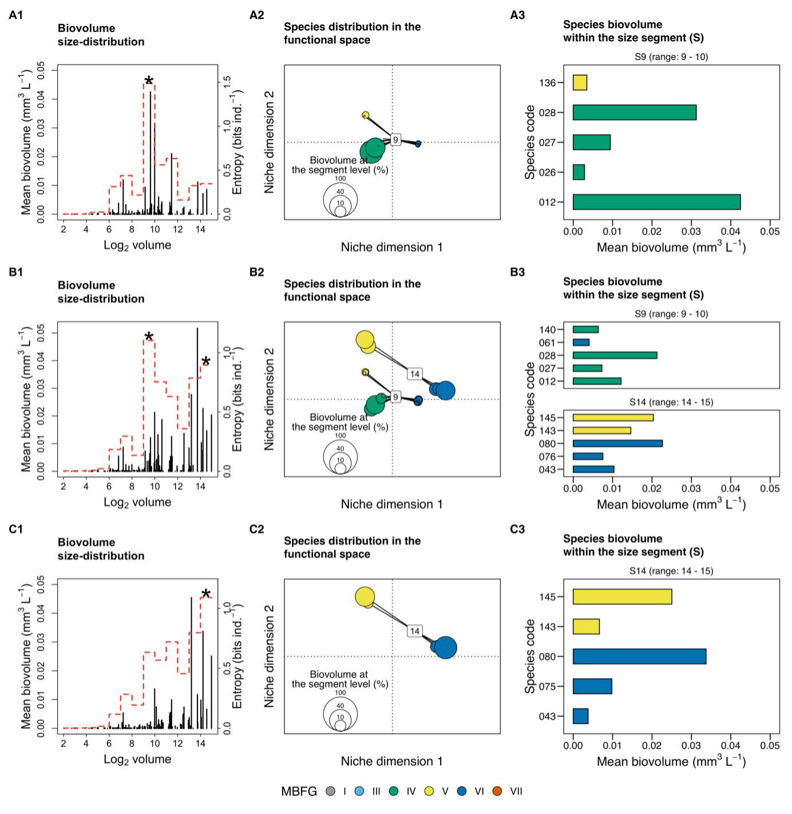
```
]
  .panel[.panel-name[Mantel]
.tiny[
```{r, echo=FALSE}
require(tidyverse)
require(gt)
tribble(~groups,        ~ category ,   ~variable, ~"Clump I", ~"Clump II", ~"Overall", 
"Seasonal patterns",    "Dry season", "Mantel r", -0.14,.13,.25,
#"Seasonal patterns",    "Dry season", "Species richness", 22,4,135,
"Seasonal patterns",    "Dry season", "p-value", .71,.09,.01,
"Seasonal patterns",    "Wet Season", "Mantel r",-.16,.06,.29,
#"Seasonal patterns",    "Wet Season", "Species richness",11,20,123,
"Seasonal patterns",    "Wet Season", "p-value",.69,.24,.01,
"Spatial patterns",    "Upper course", "Mantel r", .23,NA,.17,
#"Spatial patterns",    "Upper course", "Species richness", 17,NA,100,
"Spatial patterns",    "Upper course", "p-value", .02,NA,.01,
"Spatial patterns",    "Medium course", "Mantel r",-.16,.06,.21,
#"Spatial patterns",    "Medium course", "Species richness",5,23,135,
"Spatial patterns",    "Medium course", "p-value",.65,.22,.01,
"Spatial patterns",    "Lower course", "Mantel r",NA, -.23,.33,
#"Spatial patterns",    "Lower course", "Species richness",NA,5,122,
"Spatial patterns",    "Lower course", "p-value", NA,.75,.01) %>% 
  pivot_longer(cols=c("Clump I","Clump II","Overall"), names_to="Grouping") %>% pivot_wider(names_from="variable",values_from="value") %>%
  gt(groupname_col = c("groups","category")) %>%
    tab_header(
title = "Pairwise differences in abundance ~ Functional similarity"
  ) %>%
   fmt_missing(everything()) %>%
    tab_options(
    data_row.padding = px(2),
     table.font.size = px(8),
        table.width = px(500),
    row_group.background.color = "#ffffcc",
    column_labels.background.color ="#85C1E9",
    heading.background.color ="#85C1E9",
    stub.border.style = "dashed") %>% 
  tab_style(
    style = list(
      cell_fill(color = "#5499C7"),
      cell_text(weight = "bold")
      ),
    locations = cells_body(
      rows = `p-value` <= 0.05
    ))
  
```
]]
  .panel[.panel-name[GLM]
  .tiny[
```{r, echo=FALSE}
tribble(~"group", ~"category", ~"variable",~"Intercept", ~"Clump I",~"Clump II",~"Interaction",
"Seasonal patterns",        "Dry season", "Coefficient", -18.39,16.44,12.29,-11.90,
"Seasonal patterns",        "Dry season",   "p-value", 0.01, 0.01, 0.30, 0.34,
"Seasonal patterns",        "Wet season", "Coefficient", -20.420,18.33,17.73,-17.83,
"Seasonal patterns",        "Wet season",   "p-value", 0.01, 0.01, 0.01, 0.02,
"Spatial patterns",        "Upper course", "Coefficient", -7.26,5.68,NA,NA,
"Spatial patterns",          "Upper course",   "p-value", 0.01, 0.01, NA,NA,            
"Spatial patterns",          "Medium course", "Coefficient", -16.64,14.46,11.61,-11.12,
"Spatial patterns",          "Medium course",   "p-value", 0.01, 0.02, .29,.34,    
"Spatial patterns",         "Lower course", "Coefficient", -12.52,9.65,5.77,-4.57,
"Spatial patterns",          "Lower course",   "p-value", 0.01, 0.06, .48,.59)     %>% 
 #  pivot_longer(cols=c("Intercept","Clump I","Clump II","Interaction"), names_to="Grouping") %>% #pivot_wider(names_from="variable",values_from="value") %>%
   gt(groupname_col = c("group","category")) %>%
     tab_header(
       title = "log10 Biovolume ~ functional distinctiveness"
   ) %>%
    fmt_missing(everything()) %>%
     tab_options(
     data_row.padding = px(2),
      table.font.size = "8px",
         table.width = pct(100),
     row_group.background.color = "#ffffcc",
     column_labels.background.color ="#85C1E9",
     heading.background.color ="#85C1E9",
     stub.border.style = "dashed") %>%
  tab_style(
    style = list(
      cell_fill(color = "#5499C7"),
      cell_text(weight = "bold")
      ),
    locations = cells_body(column = "Intercept",
      rows = c(1:10))) %>%
    tab_style(
    style = list(
      cell_fill(color = "#5499C7"),
      cell_text(weight = "bold")
      ),
    locations = cells_body(column= "Clump I",
      rows = c(1:10)
    )) %>%
    tab_style(
    style = list(
      cell_fill(color = "#5499C7"),
      cell_text(weight = "bold")
      ),
    locations = cells_body(column= "Clump II",
      rows = c(3:4)
    ))%>%
    tab_style(
    style = list(
      cell_fill(color = "#5499C7"),
      cell_text(weight = "bold")
      ),
    locations = cells_body(column= "Interaction",
      rows = c(3:4)
    ))

```
]
]

]
]
]
---
class:fade-row2-col1 fade-row3-col1 fade-row4-col1 fade-row5-col1
---
class: fade-row3-col1 fade-row4-col1 fade-row5-col1
count:false
---
class:fade-row2-col1 fade-row4-col1 fade-row5-col1
count:false
---
class:fade-row2-col1 fade-row3-col1 fade-row5-col1
count:false
---
class:fade-row2-col1 fade-row3-col1 fade-row4-col1
count:false
---
layout:true
class:split-two

.row[.content[
# Conclusions

 - Emergent neutrality is a likely mechanism to explain species coexistence in an open and environmentally heterogeneous ecosystem.
 
 - The significance and dominance of the clumps were related to the environmental conditions.
 
 - Use of MBFGs and trait dimensions helps to unveil the quasi-neutral patterns.
]]
.row[.content[
### Future directions

 - Empirical studies of long-term data at finer sample scale.
 
 - Include intraspecific trait variations?
]]
---
class: hide-row2
count:true
---

---

layout:false
class: center, middle, inverse

# .white[Functional similarity at the regional scale]
###  .white[Functional rather than taxonomic diversity reveals changes in the phytoplankton community of a large dammed river.]
#### .white[Published in] .yellow[Ecological indicators]

---
class:inverse split-two

.column[.content[
### Overview

- Phytoplankton as model organism.

- Dams as environmental constraint.

- Balance between dispersal and niche differences.

```{r, echo=FALSE, out.width="80%", fig.align='center'}
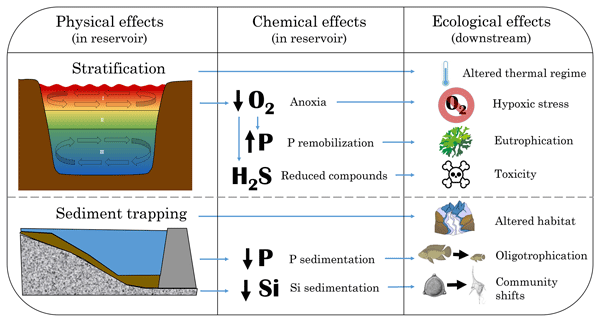
```

]]


.column[.content[ 

### Community similarity and partition (Turnover and Nestedness).

```{r, echo=FALSE, out.width="60%", fig.align="center"}
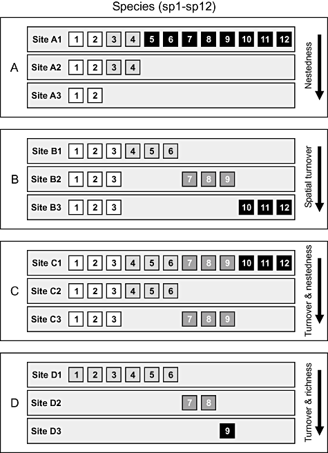
```
]
]
???
No segundo capítulo nós utilizamos a comundidade fitoplanctônica para testar a relação entre a composição funcional e a composição taxonomica às diferentes variações ambientais. Pra isso nós consideramos um rio impactado por multiplas barragens, uma vez que as barragens vão estar relacionadas tanto à limitação por dispersão quanto as variações ambientais. 
A perda de similaridade pode ocorrer através de dois mecanismos, a substituição de espécies ou traços (chamado turnover), e a perda ou ganho de espécies ou traços (chamado nestedness). Em geral, esses dois mecanismos estão sempre presentes, mas o balanço entre eles é o que vai determinar os processos que a comunidade está passando. 
---
layout:true
class:split-five with-border
.row.bg-main1[.content.vmiddle[
# Hypotheses]]
.row.bg-main2[
.content.vmiddle.center[
 .bold[H<sub>1a</sub>] – Taxonomical turnover is higher than functional turnover especially in the dam-free stretches of the river because the river flow selects for a random subset of functionally redundant species, i.e., species functionally adapted to turbulent environments.
]]
.row.bg-main3[
.content.vmiddle.center[
.bold[H<sub>1b</sub>] – The lentic-lotic gradient promoted by river damming increases the functional nestedness below the dam because species with traits adapted to lentic environments will be filtered as water flow increases.
]]
.row.bg-main4[
.content.vmiddle.center[
.bold[H<sub>2</sub>] – Dam-induced flow regime leads to higher functional diversity towards the dam because the reduction in water flow allows species with different traits combinations to colonize the increasingly lentic-stretches.
]]
.row.bg-main1[.content[

]]
---
class: fade-row3 gray-row3 fade-row4 gray-row4
---
class: fade-row2 gray-row2 fade-row4 gray-row4
count:false
---
class: fade-row3 gray-row3 fade-row2 gray-row2
count:false
---

layout:false
class:split-two

.column[.split-five[
.row.bg-main1[.content[

# Methods
210 sampling sites (every 5 km) crossing five dams in total.
]]
.row.bg-main2[.content[
Reservoirs had heterogenous characteristics
]]
.row.bg-main3[.content[
Study was divided in two scales
]]
.row.bg-main4[.content[
Phytplankton samples, environmental variables and land-use
]]
.row.bg-main5[.content[
Watercourse distance and distance from the dam.
]]
]]
.column[.content[
.panelset[
  .panel[.panel-name[Map]
```{r, echo=FALSE, out.width='100%', fig.align='center', fig.cap="Souce: GRACO-ROZA et al. 2020"}
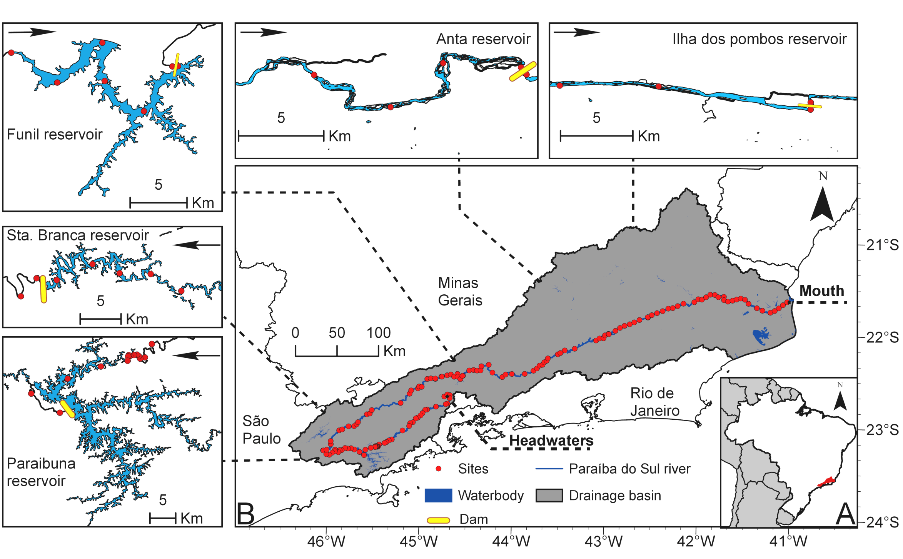
```
]
.panel[.panel-name[Reservoirs]
```{r, echo=FALSE, out.width='100%', fig.align='center', fig.cap="Souce: GRACO-ROZA et al. 2020"}
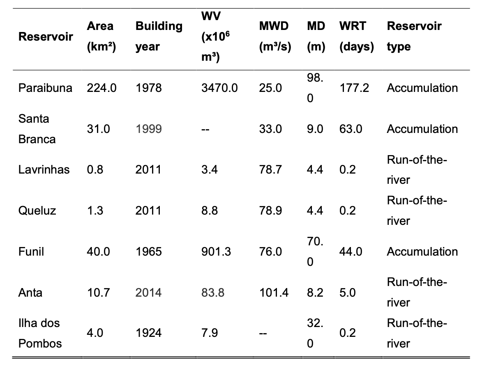
```
]
.panel[.panel-name[Variables]
.pull-left.bg-main1[.bold[Local variables]
- Turbidity
- Ammonium
- Soluble reactive phosphorus
- Total phosphorus
- Silica
- pH 
- Water temperature]

.pull-right.bg-main2[.bold[Phytoplankton traits]
- Volume
- Surface
- Surface volume ratio
- Maximum linear dimension
- Flagella
- Mucilage
- Aerotopes]

.pull-left.bg-main3[.bold[Land use]
- Natural
- Pasture
- Urban
- Agriculture]

.pull-right.bg-main4[.bold[Distance variables]
- Watercourse distance
- Distance from the nearest dam
]

]]

]
]
]
]
---
class:split-two

.column[.content[
### Methods (Hypothesis testing)

.bold[Both scales]

.pull-left[
- Community distinctiveness

- Functional dispersion <br>(functional diversity).

- Shape of relationship <br> (Linear, quadratic, breakpoint) 

- Boosted regression trees <br> (Variable importance)

]
.pull-right[
```{r, echo=FALSE,out.width="1000%", fig.align="center"}
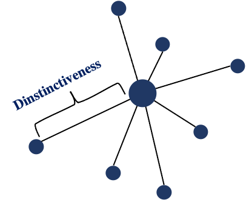
```
]
<br>
.bold[Only reservoir scale]

- Community weighted means
- Non-metric dimensional scaling with general additive models

]]
 
.column[.content.vmiddle.center[
```{r,echo=FALSE, out.width="70%"}
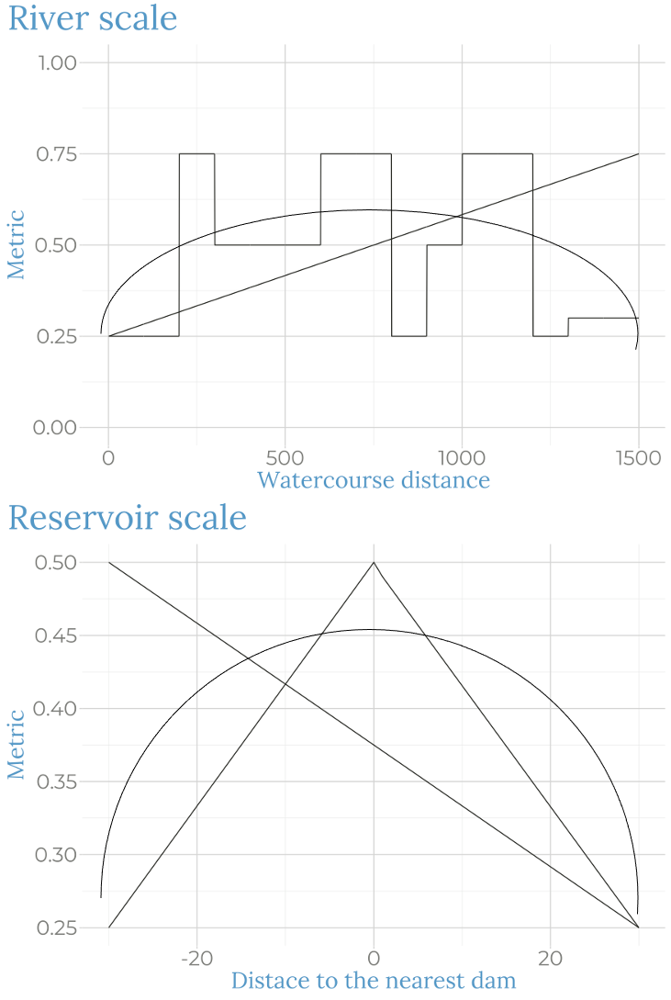
```
]]


???
Para testar nossas hipóteses em escala regional, nós utilizamos a distinção da comunidade que pode ser interpretada como a contribuição de uma amostra para a dissimilaridade regional. T

---
class:split-two

.column[.content[
### Results

- Taxonomic distance decay

- Functional nestedness below Funil reservoir .tiny[(KREB; BUDIONO, 2005; DA SILVA et al., 2015)].

- Functional dispersion increase after the joint of tributaries.

- Taxonomic nestedness.

- Local variables explained about 50 – 60%  of the taxonomic community distinctiveness.

- Functional dispersion had the highest explained deviance of the functional indices on BRT (20.8%) 

- Land use was an important driver of functional diversity.
]]

.column[.content.nopadding[
.panelset[
  .panel[.panel-name[Shape of the curve]
```{r, echo=FALSE, out.width='100%', fig.align="center", eval=TRUE, warning=FALSE, message=FALSE}
library('strucchange')
library('betareg')
library('ggplot2')
library('ggthemes')
library('patchwork')
library("AICcmodavg")
library("MuMIn")
load("data/cap2.RData")
source("data/model selection.R")
attach(beta_large)
f1_a<-mod_sel(ttot,wc,scale='Large',z=150,ylim=c(0,1),y_label="Total")+xlab('')+ggtitle("Taxonomic")
f1_b<-mod_sel(ttur,wc,scale='Large',z=150,ylim=c(0,1),y_label="Turnover")+xlab('')
f1_c<-mod_sel(tnes,wc,scale='Large',z=150,ylim=c(0,1),y_label='Nestedness')
f1_d<-mod_sel(ftot,wc,scale='Large',z=150,ylim=c(0,1),y_label='Total')+xlab('')+ggtitle("Functional")
f1_e<-mod_sel(ftur,wc,scale='Large',z=150,ylim=c(0,1),y_label='Turnover')+xlab('')
f1_f<-mod_sel(fnes,wc,scale='Large',z=150,ylim=c(0,1),y_label='Nestedness')+xlab('')
f1_g<-mod_sel(fdis,wc,scale='Large',z=150,y_label='Dispersion')
detach(beta_large)

panel_1 <- (f1_a+ f1_b+ f1_c+ grid::textGrob('Reservoirs abreviation\nPB = Paraibuna\nST = Santa Branca\nFN = Funil\n AN = Anta\nIP = Ilha dos Pombos'))+ plot_layout(ncol=1) & theme_xaringan(text_font_size = 10, title_font_size = 12)


panel_2 <- (f1_d + f1_e +f1_f+f1_g) + plot_layout(ncol=1) & theme_xaringan(text_font_size = 10, title_font_size = 12)
panel_1|panel_2
# obj1 <- ggpubr::as_ggplot(patchwork::patchworkGrob(panel_1))
# obj2 <- ggpubr::as_ggplot(patchwork::patchworkGrob(panel_2))
# 
# (obj1|obj2)
```
]
.panel[.panel-name[Variable importance]
.tiny[
```{r, echo=FALSE}
tribble(~"variables", ~"23.7%",~"33.53%",~"25.7%",~"6.9%",~"2.1%",~"10.3%",~"20.8%",
"Turb", 5.8, 6.6, NA, 2.2, 6.8, NA, 8.2,
"NH4", 15, 8.9,NA,7.2,9.4,NA,NA,
"SRP",6.3,4.4,NA,10.1,13.2,NA,NA,
"TP",NA,3.9,30.6,1.6,7.7,27.8,18.2,
"Si",11.1,6.5,NA,7.3,6.2,NA,14,
"pH",10.7,9.8,21.3,14.4,25.9,NA,10.7,
"WT",10.3,9.5,NA,7.9,15.7,NA,11.4,
"Natural",NA,3,NA,8.7,1.3,NA,NA,
"Pasture",NA,8,22,2.1,2.7,NA,NA,
"Agriculture",NA,3.4,NA,4.3,1.3,NA,13,
"Urban",NA,1,NA,10,1,NA,NA,
"WD",40.7,34.8,26,14.7,8.8,72,24.3,
"FR",NA,NA,NA,9.3,NA,NA,NA) %>% #"R²", 23.7,33.53,25.7,6.9,2.1,10.3,20.8)
  add_column(group = c(rep("Local variables", 7),
                       rep("Land use variables", 4),
                       rep("Spatial variables", 2))) %>%
   gt(groupname_col = c("group"), rowname_col = "variables") %>%
  tab_spanner(label=html("TCD<sub>Total</sub>"), columns="23.7%") %>%
  tab_spanner(label=html("TCD<sub>Turnover</sub>"), columns="33.53%") %>%
  tab_spanner(label=html("TCD<sub>Nestedness</sub>"), columns="25.7%") %>%
  tab_spanner(label=html("FCD<sub>Total</sub>"), columns="6.9%") %>%
  tab_spanner(label=html("FCD<sub>Turnover</sub>"), columns="2.1%") %>%
  tab_spanner(label=html("FCD<sub>Nestedness</sub>"), columns="10.3%") %>%
  tab_spanner(label=html("F<sub>Dispersion</sub>"), columns="20.8%") %>%
     tab_header(
       title = "Boosted regression trees at the river scale"
   ) %>%
    fmt_missing(everything()) %>%
     tab_options(
     data_row.padding = px(2),
      table.font.size = "8px",
         table.width = pct(100),
     row_group.background.color = "#ffffcc",
     column_labels.background.color ="#85C1E9",
     heading.background.color ="#85C1E9",
     stub.border.style = "dashed") %>%
  data_color(
    columns =everything(),
    colors = scales::col_numeric(
      palette = paletteer::paletteer_d(
        palette = "ggsci::blue_material"
        ) %>% as.character(),
      domain = NULL
      ))
```
]
]
]
]]
---
class:split-two

.column[.content[
### Results (Reservoir scale)

- Only FCD showed significant trends

- Niche-based processes drive the patterns of species turnover .tiny[(VILLÉGER; GRENOUILLET; BROSSE, 2013; BRAGHIN et al., 2018)]

- Interplay between dispersal and flow regulation.

- .bold[Water residence time] explained about 8% of the total variance in functional dispersion and total distinctiveness

- .bold[Distance to the nearest dam] was the most importance variable for functional metrics on BRT.
]]

.column[.content.nopadding[
.panelset[
  .panel[.panel-name[Shape of the curve]
```{r, echo=FALSE, out.width='100%', fig.align="center"}
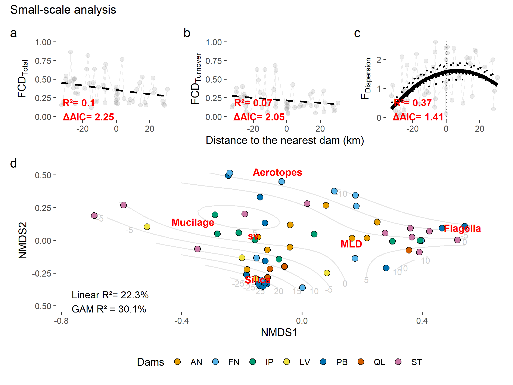
```
]
.panel[.panel-name[Variable importance]
.tiny[
```{r, echo=FALSE}
tribble(~"variables", ~"5.5%",	~"4.1%",	~"12.1%",	~"6.5%",	~"-4.1%",~"4.0%",	~"27.8%",
"Turb",NA,4.6,11,14.1,14,NA,27,
"NH4",20.4,11.3,NA,11,8.2,NA,NA,
"SRP",32.5,3.4,NA,NA,1.8,17.8,NA,
"TP",NA,6.3,20.4,NA,3.4,30.9,NA,
"Si",NA,13.6,11.3,NA,10,36.4,NA,
"pH",47,24.5,14.7,15,12.1,NA,NA,
"WT",NA,8,34.7,18,8,14.9,NA,
"Natural",NA,.46,NA,NA,NA,NA,40.51,
"Pasture",NA,15.51,NA,NA,NA,NA,NA,
"Agriculture",NA,NA,NA,NA,NA,NA,NA,
"Urban",NA,1.31,NA,NA,NA,NA,NA,
"Damdist",NA,1.94,7.9,31.91,34.40,NA,32.47,
"WRT",NA,8.22,NA,9.89,8.03,NA,NA) %>%
  add_column(group = c(rep("Local variables", 7),
                       rep("Land use variables", 4),
                       rep("Spatial variables", 2))) %>%
   gt(groupname_col = c("group"), rowname_col = "variables") %>%
  tab_spanner(label=html("TCD<sub>Total</sub>"), columns="5.5%") %>%
  tab_spanner(label=html("TCD<sub>Turnover</sub>"), columns="4.1%") %>%
  tab_spanner(label=html("TCD<sub>Nestedness</sub>"), columns="12.1%") %>%
  tab_spanner(label=html("FCD<sub>Total</sub>"), columns="6.5%") %>%
  tab_spanner(label=html("FCD<sub>Turnover</sub>"), columns="-4.1%") %>%
  tab_spanner(label=html("FCD<sub>Nestedness</sub>"), columns="4.0%") %>%
  tab_spanner(label=html("F<sub>Dispersion</sub>"), columns="27.8%") %>%
     tab_header(
       title = "Boosted regression trees at the reservoir scale"
   ) %>%
    fmt_missing(everything()) %>%
     tab_options(
     data_row.padding = px(2),
      table.font.size = "8px",
         table.width = pct(100),
     row_group.background.color = "#ffffcc",
     column_labels.background.color ="#85C1E9",
     heading.background.color ="#85C1E9",
     stub.border.style = "dashed") %>%
  data_color(
    columns =everything(),
    colors = scales::col_numeric(
      palette = paletteer::paletteer_d(
        palette = "ggsci::blue_material"
        ) %>% as.character(),
      domain = NULL
      ))
```
]
]
]
]]
---


# Conclusions

- Land use changes affected functional community assembly especially when the whole river channel was considered.

- The combination of reservoir attributes (e.g., water outlet, water retention time) with surrounding land use changed the community composition in a way that could be perceived even at larger spatial extents

- Taxonomic diversity metrics are important tools to understand community changes, but none of the major spatial patterns would have been noticed without the functional approach. 

---

class: center, middle, inverse

# .white[Functional similarity at the global scale]
###  .white[A global synthesis of taxonomic and functional turnover in ecological communities.]
#### .white[Under review in] .yellow[Ecography]

---
class:middle, center 


### Do functional features explain more of the distance decay along environmental gradients than species identities? 


.footnote[.right[(MEYNARD et al., 2011; SPASOJEVIC et al., 2014; WEINSTEIN et al., 2014; JYRKÄNKALLIO-MIKKOLA; HEINO; SOININEN, 2016)].]

---
class:split-two


.column[.content[ 
### Hypotheses

- Spatial factors relate with taxonomic more than functional composition as a result of dispersal processes.

- β-diversity should decrease with increasing latitude. .tiny[(ROHDE, 1996; DRAKARE; LENNON; HILLEBRAND, 2005; )]

- Distance decay is also likely to be affected by the spatial extent of a given study. .tiny[(STEINBAUER et al., 2012; NEKOLA; MCGILL, 2014)] 

- Distance decay vary among the realms. .tiny[(CLARKE, 1992; CORNELL; HARRISON, 2014)]

]]

.column[.content.vmiddle.center[
```{r,echo=FALSE, out.width="95%"}
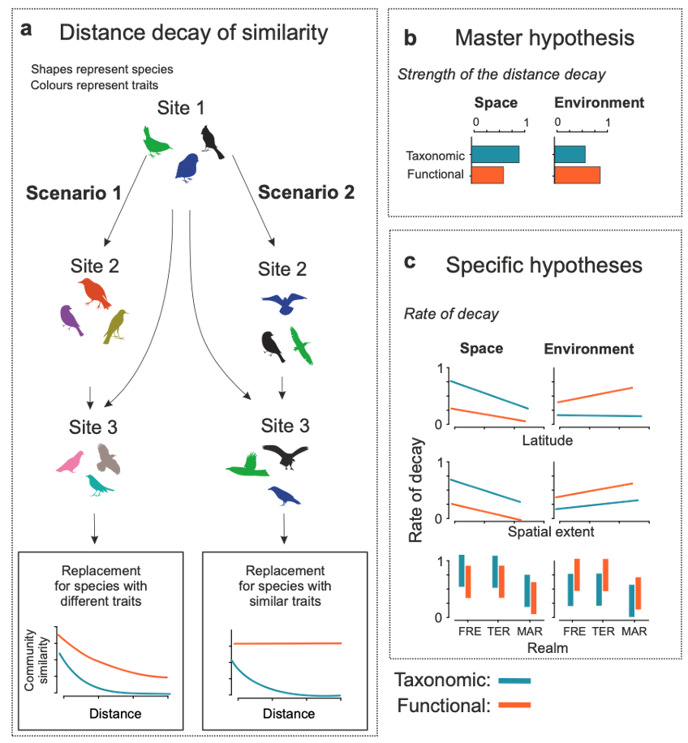
```

]]
---
class:split-two

.column[.nopadding[
### Data collection
```{r,echo=FALSE, out.width="80%"}
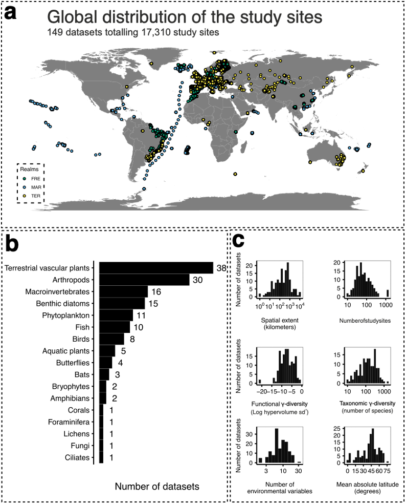
```
]]

.column[.content[
### Data analysis
```{r,echo=FALSE, out.width="80%"}
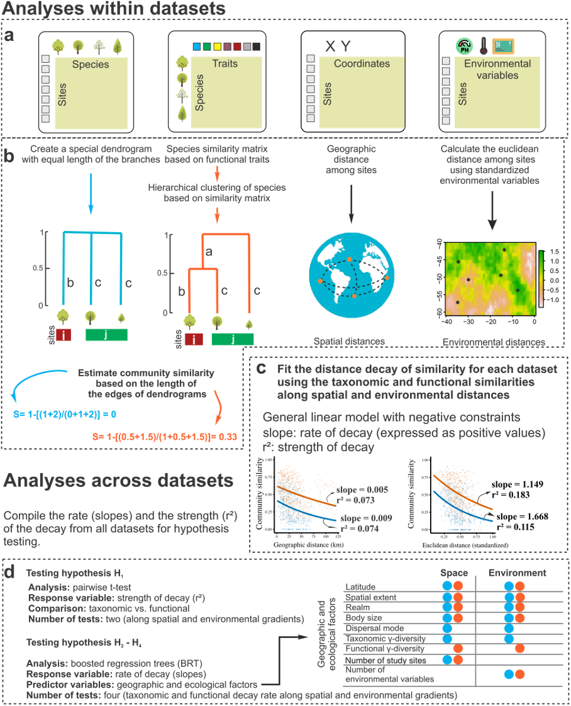
```
]]
---
class:split-two
.column[.content[
### Results

- Taxonomic distance decay is a robust approach for ecological and biogeographical studies

- Functional composition does not strongly reflect dispersal limitations or species pool effects .tiny[(SOININEN et al., 2016)]

- Context-dependency .tiny[(SIEFERT et al., 2013; KRUK et al., 2011; GRACO-ROZA et al., 2020)].

- 40 datasets showed stronger functional than taxonomic decay.

- Terrestrial plants had the steepest slopes along spatial distance both for taxonomic and functional similarities. .bold[no explanation in the literature.]

- Taxonomic variation was higher in space, while functional variation was higher in environmental gradients.
]]
.column[.content.nopadding[
.panelset[
.panel[.panel-name[Rate of decay]
```{r, echo=FALSE, fig.align="center"}
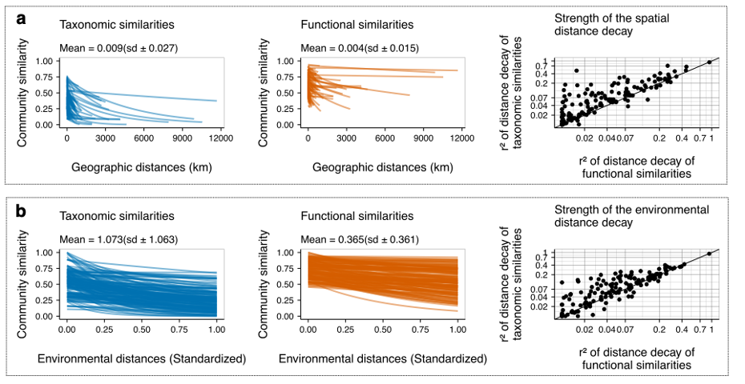
```
]
.panel[
.panel-name[Across taxa]
```{r, echo=FALSE, out.width="80%", fig.align="center"}
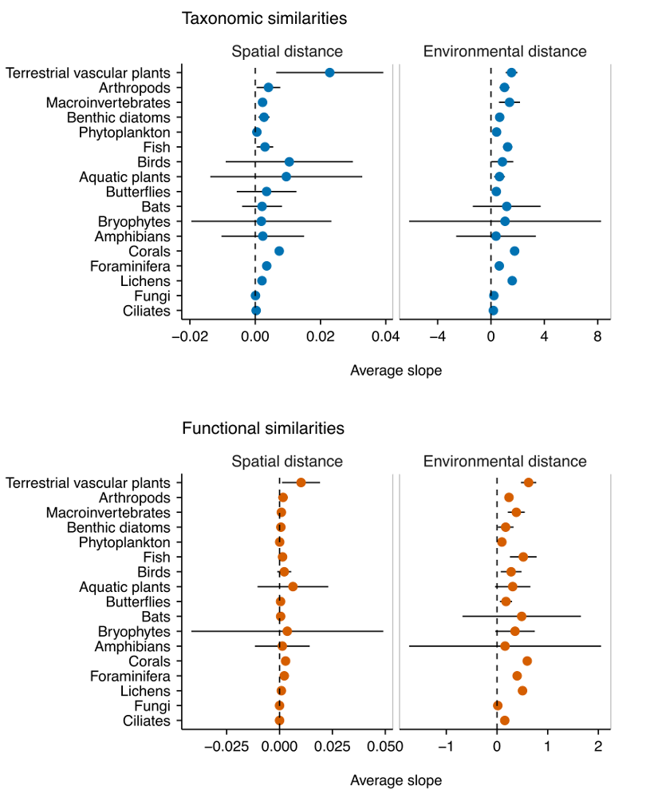
```

]
]
]]

---
class:split-two
.column[
.content[
### Results

- Latitudinal breakpoint .tiny[(SOININEN; HEINO; WANG, 2018)].

- Fragmentation .tiny[(JAMONEAU et al., 2012)].

- Higher functional diversity at higher latitudes .tiny[(MAY; MACARTHUR, 1972; LAMANNA et al., 2014)]

- Lower rate of decay ar higher spatial extent.

- Environmental filtering and species pool.

- Lowest rate at the marine realm for taxonomic similarity .tiny[(SOININEN; MCDONALD; HILLEBRAND, 2007)].

- Body size patterns (complexity or lack of information?)

- Passive (micro vs. macroorganisms)

]]
.column[.content.nopadding[
.panelset[
.panel[.panel-name[Main hypotheses]
```{r, echo=FALSE}
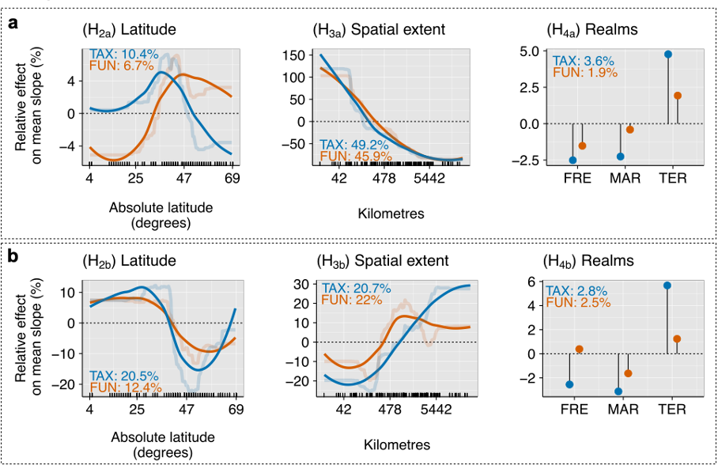
```
]
.panel[
.panel-name[Biological variables]
```{r, echo=FALSE}
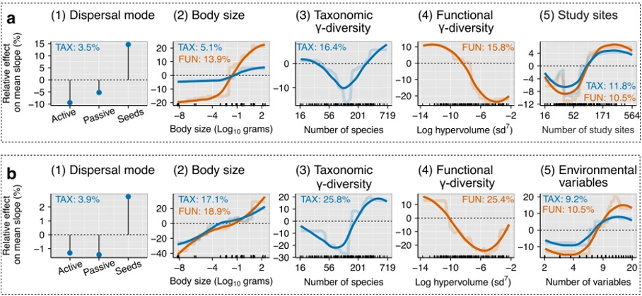
```

]
]
]]
---
### Conclusions

- Functional distance decay is scale-dependent

- Distance decays are a product of geographic and biological factors

- Disentangling the contribution of taxonomy and functional features to community variations is challenging.

---
class:inverse

# General discussion

- High-level processes .tiny[(VELLEND, 2016)].

- Environmental selection acts on species by limiting the range of trait values. .tiny[(WEIHER; KEDDY, 1995; MAYFIELD; LEVINE, 2010)]

- Body size is a powerful feature, but structure may not always be present .tiny[((DOWNING et al., 2014))].

- Trait-hierarchy .tiny[(FORT; CRUZ; JOUANY, 2014; KRAFT et al., 2014)].

- Different traits may perform the same function .tiny[(LITCHMAN; KLAUSMEIER, 2008; LITCHMAN; OHMAN; KIØRBOE, 2013)].

- Dispersal limitation and functional traits.

- Dispersal is often outplayed by selection in the assembly of microorganisms being repeatedly assumed that “everything is everywhere, but the environment selects” .tiny[(BAAS BECKING, 1934)].


---
class:inverse
# Concluding remarks


- At the local scale, trait-based approaches allows the identification of both niche partitioning and trait hierarchy on cluster of species assumed to be neutral, highlighting the role of functional similarity to biotic interactions.
 
- Focusing on species traits rather than species identity allowed assessing the balance between niche and dispersal in cases where only species identity would not be enough. 
 
- Functional similarity of multiple communities is scale-dependent and a product of large-scale geographic factors (latitude), and species and functional $\gamma$-diversity, but is also driven by organisms’ biology to some degree.

---

class:middle, center 

#Thank you!

---